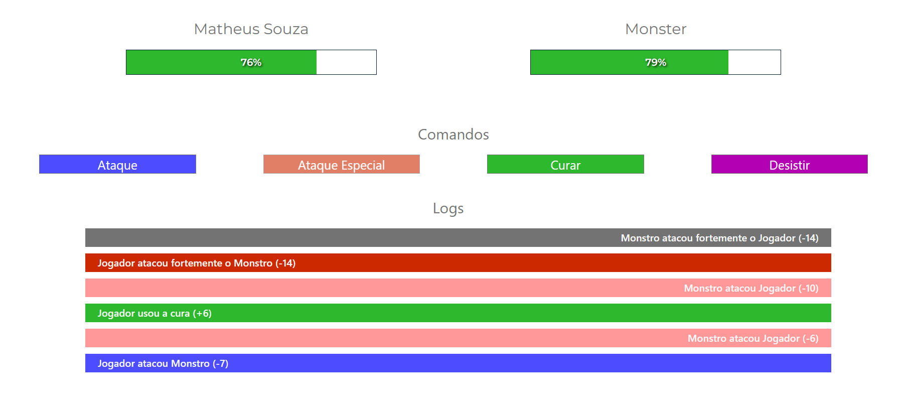

# GAME MONSTRO

> Mini Game estilo RPG, onde o objetivo seja derrotar o Monstro.



## 💻 Pré-requisitos

Antes de começar, verifique se você atendeu aos seguintes requisitos:

* Você instalou a versão mais recente de `Node.js`
* Você leu documentação `React Js`.

## 🚀 Instalando Game Monster

Para instalar o Game Monster, siga estas etapas:

Clonando o Projeto
```
git clone https://github.com/superTheus/game-project.git
```
Baixar dependências
``` 
npm install 
``` 
ou caso use YARN 
``` 
yarn 
```

## ☕ Usando o Jogo

Para usar o jogo, siga estas etapas:

``` 
npm run start 
``` 
ou caso use YARN 
``` 
yarn start 
```

Leia as regras ao Clicar no link de Regras na tela inicial do Jogo.

[⬆ Voltar ao topo](#game-monstro)
